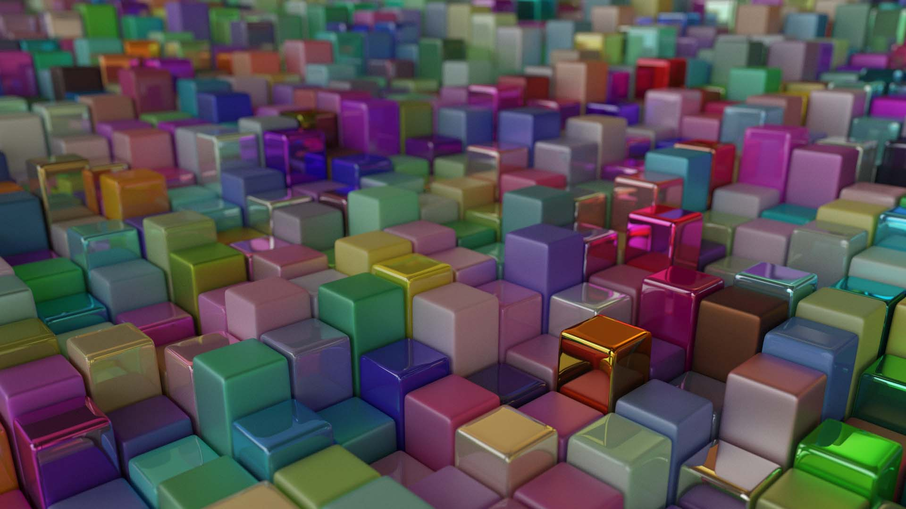
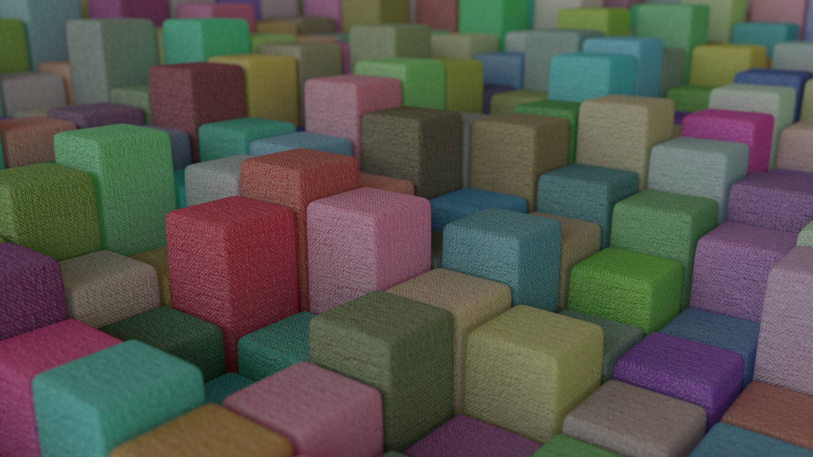
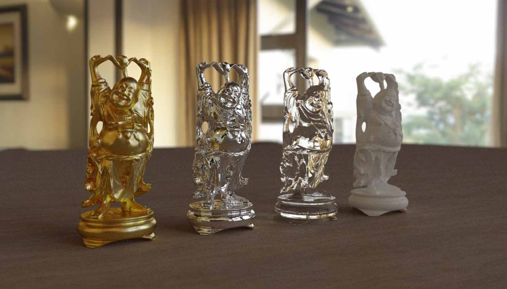

# CUDA Path Tracer

基于CUDA的光线追踪渲染器。清华大学《高等计算机图形学》Fall 2019课程项目。

## Features

- 分布式光线追踪
- 渐进式渲染
- GPU硬件加速
- 景深
- 基于kd-tree的场景求交加速（表面积启发式切分）
- 各种材质模型
  - Lambert模型
  - 发光体
  - 玻璃材质
  - 基于Cook-Torrance模型的PBR材质
  - ~~次表面散射模型~~(已经在做了.jpg)
- 各种几何体
  - 基本图元(Box, Sphere, Triangle)
  - B样条曲线旋转体
  - 三角网格（支持法线插值）
- 从obj格式载入三角网格（不完全）
- 纹理映射（PBR贴图，法线贴图等）
- 多重重要性采样 (Multiple Importance Sampling) 、直接光照
- HDR环境贴图
- 基于ImGUI的简易图形界面（WASD+Space+Shift控制摄像机位置，IJKL控制摄像机角度，其余摄像机参数在控制面板中调节）

## Results

- cheshuo (less spp)

    

- haokande cheshuo (2000 spp)

    

- 爷是阿吽

    

- 神必长方体（随机Cook-Torrance材质）

    

- 神必长方体2（法线贴图）

    

- 大家佛（```buddha.mp4```中的一帧，完整视频位于```result/buddha/```下）

    

## Usage

如需运行代码，请自行配置OpenGL及CUDA相关。其余详见代码111

由于模型、材质等资源文件过大，故未放出，如有需要请联系zjt
